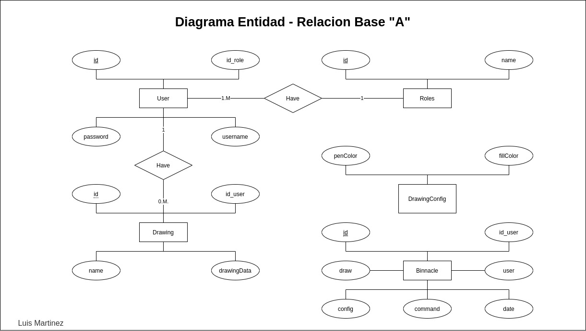
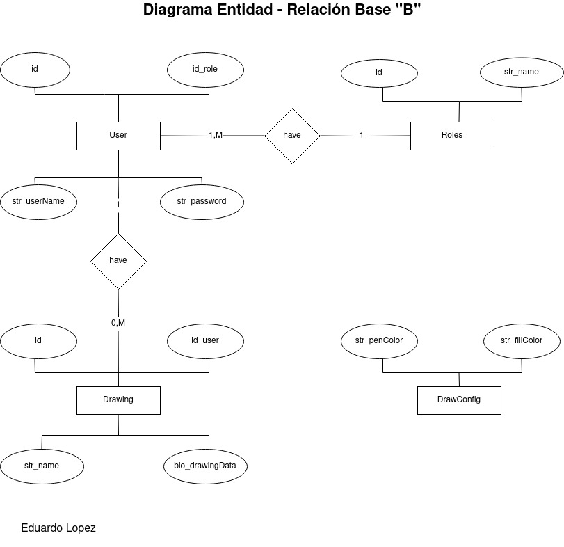

```
III PAC 2020 IS - 501 Base de Datos I 1100 @date 2020/12/12 @author lemartinezm@unah.hn eglopezl@unah.hn
```
# Proyecto Final Bases de Datos I
* Documentacion del proyecto final de bases de datso I.

## Herramientas utilizadas
* Python 3
* MariaDB 10.3 o
* Mysql 5.7
* Tkinter

--------------------------------
## Forma de Trabajo
* Se identifica que el proyecto consta de partes fundamentales las cuales definen la forma en la que se comienza a trabajar, las cuales son:

    * **Desarrollo en python**
    * **Desarrollo de las bases de datos** 

    se acordo que ambos integrantes del proyecto tabajarian en ambas partes a la vez que se avanzara en el.

    **Planificado:**

    * Inicialmente para la elaboracion del proyecto se cuenta con mas integrantes.
    * Se divide en parejas para realizar las 2 partes fundamentales encontradas.
    * La pareja que se encarga del desarrollo en python se dividen el trabajo que tambien constaba de 2 partes que son:
        * Desarrllo de la parte grafica del proyecto, junto a ventanas emergentes, ventanas de errores y botones.
        * Desarrollo de la funcionalidas que acompañan la parte grafica y la conexión con la base de datos.
    * Igualmente la otra pareja se encarga del desarrollo de las bases de datos las cuales son 2 asi que se dividen en 2 partes.
        * Desarrolo de la Base de Datos principal.
        * Desarrollo de la Base de Datos de Respaldo.

    **No Planificado**

    * No se cuenta con todos los hechos que ocurren en el III periodo academico de la UNAH en el 2020.
    * Incluidos los siguientes hechos:
        * Crisis sanitaria a nivel mundial por el Covid-19
        * Paso de 2 huracanes devastadores para nuestro país.
    * Abandono de la clase de compañeros de trabajo por los eventos antes mencionados.
    * Cambio en lo inicialmente planificado.

--------------------------------------
## Desarrollo en python
* Tener instaladas y descargadas la herramientas identificadas necesarias para la realización del proyecto.
* Creación de la interfaz grafica de dibujo en tkinter. Codigo obtenido en el libro: **Data Structures and Algorithms with Python 2nd, 2015, Kent D. Lee, Steve Hubbard**
* Del codigo obtenido se procede a fragmentarlo en modulos diferentes y separandolos por clases.
* Creación del main.py
* Creación del directorio core
* Dentro del core se encuentran las siguientes carpetas.
    * **entities:** Contiene los archivos con sus clases de las entidades identificadas.
        * **Draw:** Clase de la entidad de dibujo.
        * **User:** Clase que contiene la entidad Usuario.
    * **gui:** Contiene archivos de la creación de las ventanas graficas con python3 tkinter.
        * **AdminWindow.py:** Archivo encargada de la ventana grafica que contiene las opciones para el administrador.
        * **AuthWindow.py:** Archivo encargado del login de la aplicación.
        * **DrawingWindow.py:** Archivo encargado que muestra el area para crear dibujos.
        * **DrawManager.py:** Archivo que se encarga de algunas configuraciones de los dibujos.
        * **LoadDrawWindow.py:** Archivo encargado de la ventana grafica para seleccionar un dibujo a cargar.
        * **Pylist.py:** Archivo encargado de los comandos para la poder dibujar en la ventana el dibujo seleccionado.
        * **SaveDrawWindow.py:** Archivo de la ventana grafica que guarda un dibujo.
    * **modules:** Contiene los directorios de los modulos necesarios para la correcta funcionalidad del proyecto.
        * **admin:** Donde estan desarrolladas las funcionalidades del administrador.
        * **auth:** Autenticación de usuarios.
        * **compress:** Compresion de los datos.
        * **database:** Conexion con las bases de datos.
        * **draw:** Conexion de los dibujos con el motor mysql.

### Previsualización de la estructura del directorio desarollado en python.

    * main.py
    * core
        - entities
            * Draw.py
            * User.py
        - gui
            * AdminWindow.py
            * AuthWindow.py
            * DrawingWindow.py
            * DrawManager.py
            * LoadDrawWindow.py
            * Pylist.py
            * SaveDrawWindow.py
        - modules
            * admin
                - AdminActionsManager.py
            * auth
                - AuthManager.py
            * compress
                - CompressManager.py
            * database
                - config.ini
                - MySQLEngine.py
            * draw
                - DrawingManager.py


----------------------------
## Diseño de las Bases de Datos

* Identificamos las entidades que debe poseer las bases de datos
* Identificamos los campos de las entidades.
* Identificamos los tipos de datos de cada uno de los campos.
* Creacion de los digramas ER Entidad relación.

Diseño del diagrama Entidad Realción de la BAse de Datos principal:


* Creacion del diagrama de tablas de la base principal.
* Creacion del diagrama ER de la base de datos de resplado.

Diseño del diagrama Entidad Relacion de la base  de datos de respaldo:



* Creación de las tablas para el diagrama de la base de respaldo.
* Creación del directorio con los scripts mysql
    * **0_tables.sql:** Contiene el codigo sql de las tablas de las 2 bases de datos
    * **1_procedures.sql:** Procedures de las bases de datos.
    * **2_triggers.sql:** Triggers de las bases de datos.
* Estructura del directorio de los scripts.
    * scripts
        * 0_tables.sql
        * 1_procedures.sql
        * 2_triggers.sql

* Mas informacion de las bases de datos consultar el documento de Diseño de las Bases de Datos: [Design Document](DatabasesDesignDocument.pdf)